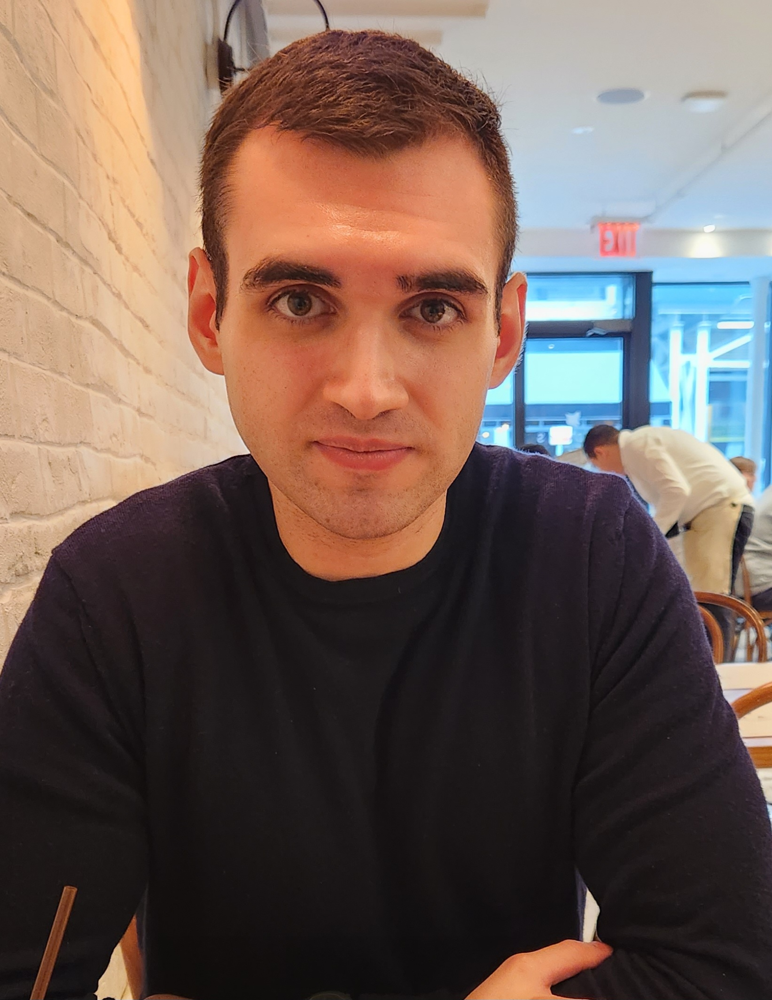

    

# Hello!
I'm Johnny. I earned my Master of Science degree in Applied Statistics in December 2023. I am very interested in Natural Language Processing (NLP) and large language models. In my free time, I have used my skills in data analysis, machine learning, and data visualization to work independently on data I find interesting. I tackle challenging problems with a multidisciplinary attitude and leverage any technology to accomplish a task. I also enjoy hiking, kickboxing, and cooking.

**Technical Skills:** Python, R, SQL, Data Science, Machine Learning, Statistics, HTML/CSS, LaTeX  
**Tools:** scikit-learn, NumPy, SciPy, matplotlib, seaborn, plotly-dash, Django, Flask, Git/GitHub, Dataiku, JMP, Minitab, RStudio, Jupyter notebooks, Tableau, Power BI  
**Languages:** English, Italian
